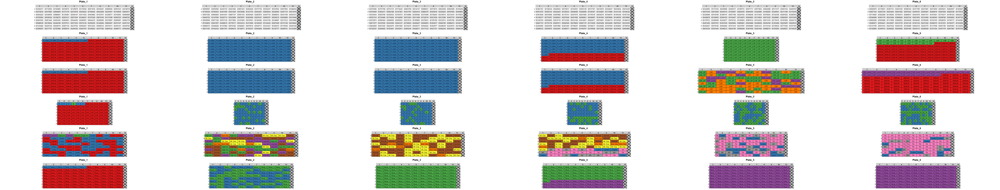
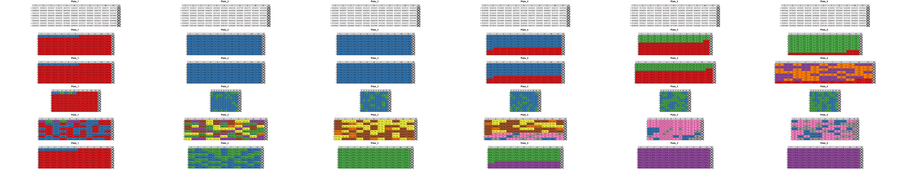

## platerandomizer package

-   This R package is designed to simplify generating of randomization
    of samples across different plate formats used in life sciences
-   The sample randomization across plates may be useful for any
    analyses sensitive to batch effect (such as OLINK)
-   This package takes into account the confounding of specified
    variable and tries to allocate samples on the same plate
-   Functions also support randomization of multiple studies at the same
    time (if space is a constraint). In this setting, package will try
    to allocate samples from the same study on one plate
-   Package also provides visualization for randomizations and allows
    visualizing of distribution for any variable on the plates

``` r
# Installing the package
remotes::install_github(repo = "AleksandrVSokolov/platerandomizer", force = TRUE)
```

``` r
# Importing
library(platerandomizer)
```

Now let’s browse package functionalities. First, it can generate plate
layouts. This is the layout for 24 well plate. Note, we reserved last
column for controls

``` r
platerandomizer::generate_well_plate_template(plate_type = "24w", reserve_last_column = TRUE)
```

    ##   1    2    3    4    5    6 
    ## A "1A" "2A" "3A" "4A" "5A" NA
    ## B "1B" "2B" "3B" "4B" "5B" NA
    ## C "1C" "2C" "3C" "4C" "5C" NA
    ## D "1D" "2D" "3D" "4D" "5D" NA

This is the 96 well plate

``` r
platerandomizer::generate_well_plate_template(plate_type = "96w", reserve_last_column = TRUE)
```

    ##   1    2    3    4    5    6    7    8    9    10    11    12
    ## A "1A" "2A" "3A" "4A" "5A" "6A" "7A" "8A" "9A" "10A" "11A" NA
    ## B "1B" "2B" "3B" "4B" "5B" "6B" "7B" "8B" "9B" "10B" "11B" NA
    ## C "1C" "2C" "3C" "4C" "5C" "6C" "7C" "8C" "9C" "10C" "11C" NA
    ## D "1D" "2D" "3D" "4D" "5D" "6D" "7D" "8D" "9D" "10D" "11D" NA
    ## E "1E" "2E" "3E" "4E" "5E" "6E" "7E" "8E" "9E" "10E" "11E" NA
    ## F "1F" "2F" "3F" "4F" "5F" "6F" "7F" "8F" "9F" "10F" "11F" NA
    ## G "1G" "2G" "3G" "4G" "5G" "6G" "7G" "8G" "9G" "10G" "11G" NA
    ## H "1H" "2H" "3H" "4H" "5H" "6H" "7H" "8H" "9H" "10H" "11H" NA

We have an example dataset containing several studies in one file.
Includes information on some phenotypes, IDs, as well as the study of
origin

``` r
data(example_data)
str(example_data)
```

    ## 'data.frame':    528 obs. of  7 variables:
    ##  $ Sample      : chr  "ID797889" "ID439793" "ID143482" "ID218619" ...
    ##  $ Sample_type : chr  "SERUM" "SERUM" "SERUM" "SERUM" ...
    ##  $ Sex         : chr  "N.M." "N.M." "N.M." "N.M." ...
    ##  $ Case_control: chr  "Cancer" "Cancer" "Cancer" "Cancer" ...
    ##  $ Study       : chr  "Study_1" "Study_1" "Study_1" "Study_1" ...
    ##  $ Variable    : chr  NA NA NA NA ...
    ##  $ Variable_2  : chr  "SERUM" "SERUM" "SERUM" "SERUM" ...

Let’s make a randomization for this data using 96 well plates. Note, we
fist have to generate a template for plates. Each row and columns MUST
be named. NA cells are skipped during randomization

``` r
plate_template = generate_well_plate_template(plate_type = "96w", 
reserve_last_column = TRUE)
test_randomization = plate_layout_randomizer(df_all_studies = example_data,  
column_study = 5, 
column_sample_type = 2, 
column_sample_ID = 1, 
column_conf = 7, 
plate_template = plate_template)
test_randomization
```

    ## $Plate_1
    ##   1          2          3          4          5          6          7          8          9          10         11         12
    ## A "ID127825" "ID868812" "ID712593" "ID145879" "ID147982" "ID255425" "ID871818" "ID272897" "ID758452" "ID136481" "ID688539" NA
    ## B "ID536461" "ID598312" "ID439793" "ID263311" "ID218619" "ID688771" "ID643832" "ID275818" "ID951445" "ID673127" "ID856297" NA
    ## C "ID953333" "ID685997" "ID843268" "ID629519" "ID655291" "ID455141" "ID968592" "ID296927" "ID566147" "ID797889" "ID395697" NA
    ## D "ID587134" "ID537885" "ID235457" "ID269182" "ID158275" "ID583197" "ID473782" "ID153761" "ID126284" "ID143482" "ID284961" NA
    ## E "ID411632" "ID277757" "ID924617" "ID574134" "ID225144" "ID338677" "ID968959" "ID272762" "ID744949" "ID847625" "ID348347" NA
    ## F "ID173179" "ID757511" "ID474618" "ID988851" "ID948793" "ID349263" "ID439656" "ID727249" "ID582725" "ID519624" "ID448199" NA
    ## G "ID939324" "ID562692" "ID113788" "ID267121" "ID844415" "ID877643" "ID299296" "ID585674" "ID944256" "ID677234" "ID742593" NA
    ## H "ID464345" "ID896989" "ID531234" "ID755964" "ID454982" "ID284778" "ID575411" "ID876165" "ID859122" "ID255255" "ID624222" NA
    ## 
    ## $Plate_2
    ##   1          2          3          4          5          6          7          8          9          10         11         12
    ## A "ID521629" "ID521199" "ID194985" "ID776357" "ID262587" "ID468615" "ID561585" "ID735777" "ID972182" "ID452427" "ID317512" NA
    ## B "ID552586" "ID779717" "ID973372" "ID194392" "ID467778" "ID232223" "ID961791" "ID557314" "ID725374" "ID373596" "ID436471" NA
    ## C "ID384858" "ID918675" "ID188419" "ID194337" "ID743274" "ID732519" "ID164334" "ID842723" "ID637318" "ID318264" "ID936277" NA
    ## D "ID134434" "ID264121" "ID444172" "ID959597" "ID438897" "ID579895" "ID991341" "ID742923" "ID979461" "ID472513" "ID573678" NA
    ## E "ID858767" "ID581163" "ID596615" "ID115546" "ID666563" "ID457116" "ID149978" "ID926524" "ID452229" "ID451496" "ID889372" NA
    ## F "ID447716" "ID915621" "ID428639" "ID515948" "ID343369" "ID121374" "ID811181" "ID222713" "ID283975" "ID715638" "ID451582" NA
    ## G "ID667669" "ID876888" "ID549711" "ID966858" "ID392881" "ID617781" "ID657352" "ID221283" "ID738671" "ID734986" "ID646128" NA
    ## H "ID924277" "ID839215" "ID317123" "ID152632" "ID877128" "ID796453" "ID338332" "ID276496" "ID355692" "ID879612" "ID468492" NA
    ## 
    ## $Plate_3
    ##   1          2          3          4          5          6          7          8          9          10         11         12
    ## A "ID138317" "ID731229" "ID931449" "ID628271" "ID376398" "ID213415" "ID672973" "ID176454" "ID264414" "ID144295" "ID341746" NA
    ## B "ID122764" "ID783481" "ID832358" "ID238566" "ID526932" "ID322224" "ID362917" "ID633698" "ID525138" "ID378641" "ID724547" NA
    ## C "ID165769" "ID832275" "ID939558" "ID669881" "ID952389" "ID699761" "ID237646" "ID914435" "ID722633" "ID668566" "ID482344" NA
    ## D "ID341237" "ID262568" "ID661557" "ID286861" "ID648697" "ID261685" "ID344647" "ID381191" "ID362577" "ID377736" "ID414657" NA
    ## E "ID737128" "ID994795" "ID393417" "ID931522" "ID353554" "ID451849" "ID529578" "ID537854" "ID264869" "ID657952" "ID597684" NA
    ## F "ID338117" "ID562958" "ID584188" "ID988274" "ID448428" "ID552151" "ID984336" "ID157799" "ID583796" "ID933832" "ID414137" NA
    ## G "ID914128" "ID916699" "ID889376" "ID696953" "ID515911" "ID732468" "ID215915" "ID729347" "ID367575" "ID998631" "ID428427" NA
    ## H "ID348174" "ID194338" "ID398464" "ID129334" "ID196983" "ID419192" "ID133459" "ID621721" "ID918692" "ID178319" "ID583828" NA
    ## 
    ## $Plate_4
    ##   1          2          3          4          5          6          7          8          9          10         11         12
    ## A "ID141145" "ID525918" "ID594222" "ID115741" "ID993245" "ID179537" "ID666826" "ID374116" "ID863759" "ID154264" "ID191562" NA
    ## B "ID887747" "ID213396" "ID871277" "ID487882" "ID533414" "ID537814" "ID325796" "ID211429" "ID573974" "ID628495" "ID912719" NA
    ## C "ID383841" "ID739653" "ID722687" "ID431787" "ID147481" "ID979958" "ID345276" "ID732326" "ID147595" "ID352532" "ID117886" NA
    ## D "ID323676" "ID187126" "ID879557" "ID218295" "ID847172" "ID525312" "ID543689" "ID535251" "ID625167" "ID577892" "ID774242" NA
    ## E "ID441447" "ID784675" "ID843276" "ID219573" "ID692384" "ID532437" "ID673353" "ID563633" "ID824929" "ID722347" "ID159324" NA
    ## F "ID679469" "ID968929" "ID147361" "ID562852" "ID192862" "ID418568" "ID231322" "ID187939" "ID639173" "ID227434" "ID587466" NA
    ## G "ID181132" "ID689412" "ID691986" "ID955895" "ID333335" "ID445943" "ID144381" "ID922289" "ID358571" "ID143262" "ID263297" NA
    ## H "ID297294" "ID324582" "ID728217" "ID693988" "ID665311" "ID117658" "ID166377" "ID724155" "ID776119" "ID175217" "ID634296" NA
    ## 
    ## $Plate_5
    ##   1          2          3          4          5          6          7          8          9          10         11         12
    ## A "ID367645" "ID114144" "ID565889" "ID984565" "ID557198" "ID446878" "ID225783" "ID731416" "ID222712" "ID725957" "ID314972" NA
    ## B "ID518192" "ID673335" "ID511377" "ID638168" "ID648213" "ID824195" "ID777426" "ID297832" "ID183486" "ID742358" "ID196265" NA
    ## C "ID987814" "ID281413" "ID712164" "ID312434" "ID332855" "ID677863" "ID898515" "ID639733" "ID877711" "ID131263" "ID437597" NA
    ## D "ID793583" "ID974728" "ID179751" "ID399458" "ID322985" "ID469787" "ID284152" "ID629527" "ID451493" "ID744535" "ID449658" NA
    ## E "ID895881" "ID467494" "ID697334" "ID188248" "ID432451" "ID185751" "ID381659" "ID584582" "ID925994" "ID443877" "ID329589" NA
    ## F "ID911415" "ID349641" "ID361646" "ID176345" "ID657537" "ID157187" "ID815336" "ID173854" "ID311199" "ID926683" "ID386554" NA
    ## G "ID916459" "ID678143" "ID866456" "ID654888" "ID744427" "ID797862" "ID832237" "ID687195" "ID673292" "ID759538" "ID194767" NA
    ## H "ID746717" "ID299782" "ID248526" "ID142866" "ID548499" "ID826338" "ID787376" "ID845493" "ID457779" "ID857987" "ID369753" NA
    ## 
    ## $Plate_6
    ##   1          2          3          4          5          6          7          8          9          10         11         12
    ## A "ID516786" "ID598154" "ID631687" "ID739632" "ID183947" "ID578293" "ID996849" "ID835916" "ID459181" "ID875243" "ID461536" NA
    ## B "ID456371" "ID119931" "ID673256" "ID623463" "ID683879" "ID293139" "ID656631" "ID223955" "ID847492" "ID863555" "ID686916" NA
    ## C "ID397131" "ID927164" "ID195854" "ID371785" "ID839996" "ID715415" "ID265481" "ID248881" "ID922288" "ID746693" "ID915369" NA
    ## D "ID396747" "ID852657" "ID226135" "ID775572" "ID241284" "ID133253" "ID331282" "ID875547" "ID548445" "ID293359" "ID936976" NA
    ## E "ID687115" "ID187722" "ID243836" "ID526125" "ID279852" "ID866389" "ID232775" "ID187143" "ID643479" "ID658982" "ID651953" NA
    ## F "ID334928" "ID521914" "ID416657" "ID942315" "ID381256" "ID117969" "ID136266" "ID768361" "ID453258" "ID268369" "ID781921" NA
    ## G "ID641741" "ID141795" "ID554441" "ID849496" "ID372184" "ID765674" "ID845691" "ID289375" "ID195124" "ID174239" "ID714925" NA
    ## H "ID582369" "ID928636" "ID815429" "ID491179" "ID644648" "ID286263" "ID889537" "ID728488" "ID495871" "ID785699" "ID413778" NA

Look, we automatically decide how many plates are needed and how to
distribute samples. Making sense of randomization is difficult without
proper visualization. Thus, we can use another function from the
package, generate several randomizations and visualize one of it here.
First, we make randomizations.

``` r
setwd("C:/Users/sokol/Desktop/") # To load everything in the specific folder
plate_template = generate_well_plate_template(plate_type = "96w", 
reserve_last_column = TRUE)

randomizer_main(df_studies = example_data,  
col_num_study = 5, 
col_num_sample_type = 2, 
col_num_sample_ID = 1, 
col_num_conf = 7, 
column_numbers_vis = c(2,7,3,4,5),
plate_template = plate_template,
randomiz_number = 5, # We specified 5 randomizations to make
main_dir = "randomiz_vis_test", # Directory for raw images and excel
dir_combined_img = "randomiz_vis_combined") # Directory for combined images
```

    ## Warning in dir.create(main_dir): 'randomiz_vis_test' already exists

    ## Warning in dir.create(dir_combined_img): 'randomiz_vis_combined' already exists

Let’s view some files in the randomiz_vis_test folder

``` r
list.files("C:/Users/sokol/Desktop/randomiz_vis_test")
```

    ##   [1] "1_1_1_.png"                 "1_1_2_.png"                 "1_1_3_.png"                 "1_1_4_.png"                 "1_1_5_.png"                 "1_1_6_.png"                
    ##   [7] "1_2_1_.png"                 "1_2_2_.png"                 "1_2_3_.png"                 "1_2_4_.png"                 "1_2_5_.png"                 "1_2_6_.png"                
    ##  [13] "1_3_1_.png"                 "1_3_2_.png"                 "1_3_3_.png"                 "1_3_4_.png"                 "1_3_5_.png"                 "1_3_6_.png"                
    ##  [19] "1_4_1_.png"                 "1_4_2_.png"                 "1_4_3_.png"                 "1_4_4_.png"                 "1_4_5_.png"                 "1_4_6_.png"                
    ##  [25] "1_5_1_.png"                 "1_5_2_.png"                 "1_5_3_.png"                 "1_5_4_.png"                 "1_5_5_.png"                 "1_5_6_.png"                
    ##  [31] "1_6_1_.png"                 "1_6_2_.png"                 "1_6_3_.png"                 "1_6_4_.png"                 "1_6_5_.png"                 "1_6_6_.png"                
    ##  [37] "1_radom_table.xlsx"         "1_radom_table_simplif.xlsx" "2_1_1_.png"                 "2_1_2_.png"                 "2_1_3_.png"                 "2_1_4_.png"                
    ##  [43] "2_1_5_.png"                 "2_1_6_.png"                 "2_2_1_.png"                 "2_2_2_.png"                 "2_2_3_.png"                 "2_2_4_.png"                
    ##  [49] "2_2_5_.png"                 "2_2_6_.png"                 "2_3_1_.png"                 "2_3_2_.png"                 "2_3_3_.png"                 "2_3_4_.png"                
    ##  [55] "2_3_5_.png"                 "2_3_6_.png"                 "2_4_1_.png"                 "2_4_2_.png"                 "2_4_3_.png"                 "2_4_4_.png"                
    ##  [61] "2_4_5_.png"                 "2_4_6_.png"                 "2_5_1_.png"                 "2_5_2_.png"                 "2_5_3_.png"                 "2_5_4_.png"                
    ##  [67] "2_5_5_.png"                 "2_5_6_.png"                 "2_6_1_.png"                 "2_6_2_.png"                 "2_6_3_.png"                 "2_6_4_.png"                
    ##  [73] "2_6_5_.png"                 "2_6_6_.png"                 "2_radom_table.xlsx"         "2_radom_table_simplif.xlsx" "3_1_1_.png"                 "3_1_2_.png"                
    ##  [79] "3_1_3_.png"                 "3_1_4_.png"                 "3_1_5_.png"                 "3_1_6_.png"                 "3_2_1_.png"                 "3_2_2_.png"                
    ##  [85] "3_2_3_.png"                 "3_2_4_.png"                 "3_2_5_.png"                 "3_2_6_.png"                 "3_3_1_.png"                 "3_3_2_.png"                
    ##  [91] "3_3_3_.png"                 "3_3_4_.png"                 "3_3_5_.png"                 "3_3_6_.png"                 "3_4_1_.png"                 "3_4_2_.png"                
    ##  [97] "3_4_3_.png"                 "3_4_4_.png"                 "3_4_5_.png"                 "3_4_6_.png"                 "3_5_1_.png"                 "3_5_2_.png"                
    ## [103] "3_5_3_.png"                 "3_5_4_.png"                 "3_5_5_.png"                 "3_5_6_.png"                 "3_6_1_.png"                 "3_6_2_.png"                
    ## [109] "3_6_3_.png"                 "3_6_4_.png"                 "3_6_5_.png"                 "3_6_6_.png"                 "3_radom_table.xlsx"         "3_radom_table_simplif.xlsx"
    ## [115] "4_1_1_.png"                 "4_1_2_.png"                 "4_1_3_.png"                 "4_1_4_.png"                 "4_1_5_.png"                 "4_1_6_.png"                
    ## [121] "4_2_1_.png"                 "4_2_2_.png"                 "4_2_3_.png"                 "4_2_4_.png"                 "4_2_5_.png"                 "4_2_6_.png"                
    ## [127] "4_3_1_.png"                 "4_3_2_.png"                 "4_3_3_.png"                 "4_3_4_.png"                 "4_3_5_.png"                 "4_3_6_.png"                
    ## [133] "4_4_1_.png"                 "4_4_2_.png"                 "4_4_3_.png"                 "4_4_4_.png"                 "4_4_5_.png"                 "4_4_6_.png"                
    ## [139] "4_5_1_.png"                 "4_5_2_.png"                 "4_5_3_.png"                 "4_5_4_.png"                 "4_5_5_.png"                 "4_5_6_.png"                
    ## [145] "4_6_1_.png"                 "4_6_2_.png"                 "4_6_3_.png"                 "4_6_4_.png"                 "4_6_5_.png"                 "4_6_6_.png"                
    ## [151] "4_radom_table.xlsx"         "4_radom_table_simplif.xlsx" "5_1_1_.png"                 "5_1_2_.png"                 "5_1_3_.png"                 "5_1_4_.png"                
    ## [157] "5_1_5_.png"                 "5_1_6_.png"                 "5_2_1_.png"                 "5_2_2_.png"                 "5_2_3_.png"                 "5_2_4_.png"                
    ## [163] "5_2_5_.png"                 "5_2_6_.png"                 "5_3_1_.png"                 "5_3_2_.png"                 "5_3_3_.png"                 "5_3_4_.png"                
    ## [169] "5_3_5_.png"                 "5_3_6_.png"                 "5_4_1_.png"                 "5_4_2_.png"                 "5_4_3_.png"                 "5_4_4_.png"                
    ## [175] "5_4_5_.png"                 "5_4_6_.png"                 "5_5_1_.png"                 "5_5_2_.png"                 "5_5_3_.png"                 "5_5_4_.png"                
    ## [181] "5_5_5_.png"                 "5_5_6_.png"                 "5_6_1_.png"                 "5_6_2_.png"                 "5_6_3_.png"                 "5_6_4_.png"                
    ## [187] "5_6_5_.png"                 "5_6_6_.png"                 "5_radom_table.xlsx"         "5_radom_table_simplif.xlsx"

Massive, we have all individual layout per randomization and per plate,
and also randomizations are saved in the excel files. Browsing
individual images may be useful in some cases but it is generally better
to view the overall picture. Let render some of combined image. Let’s
say for the third layout.

``` r
list.files("C:/Users/sokol/Desktop/randomiz_vis_combined")
```

    ## [1] "1_combined_image.png" "2_combined_image.png" "3_combined_image.png" "4_combined_image.png" "5_combined_image.png"

This is the layout number 3

``` r
knitr::include_graphics("C:/Users/sokol/Desktop/randomiz_vis_combined/3_combined_image.png")
```

Note: I added this image separately to make .MD document


This is the layout number 2

``` r
knitr::include_graphics("C:/Users/sokol/Desktop/randomiz_vis_combined/2_combined_image.png")
```
Note: I added this image separately to make .MD document


Note, each plate is visualized multiple times with regards on how we
specified: column_numbers_vis = c(2,7,3,4,5)
